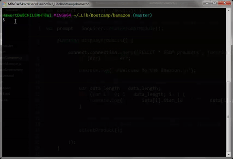
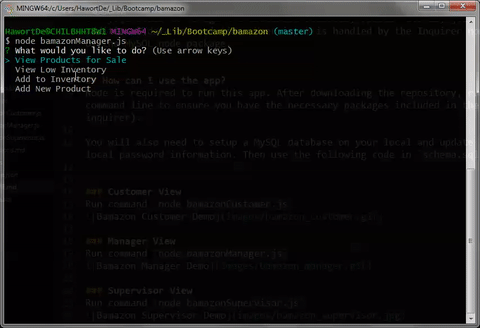
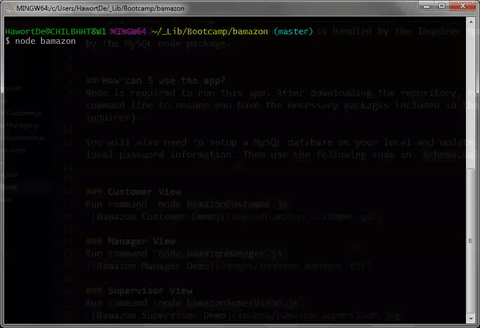

# bamazon
A command-line-interface node application that acts like an amazon storefront. The app will take in orders from customers and deplete stock from the store's inventory. It also tracks sales across the store's departments and then provides a summary of the highest-grossing departments in the store.

## How does it work?
Bamazon uses nodeJS and functions under a CLI-only; there is no deployment or GUI. It uses a series of MySQL calls to manage the localhost database, update records, join tables, and calculate additional data in real-time. User input is handled by the `Inquirer npm`; database calls are handled by the `MySQL npm`.

## How can I use the app?
`Node` is required to run this app. After downloading the repository, run `npm install` from the command line to ensure you have the necessary packages included in the package.json file (mysql & inquirer).

You will also need to setup a MySQL database on your local and update `mysql.js` to include your local password information. Then use the following code in `schema.sql` to set up your database.

### Customer View
Run command `node bamazonCustomer.js`   

### Manager View
Run command `node bamazonManager.js`   

### Supervisor View
Run command `node bamazonSupervisor.js`   
